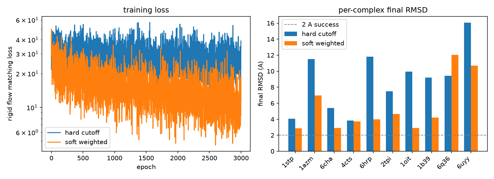
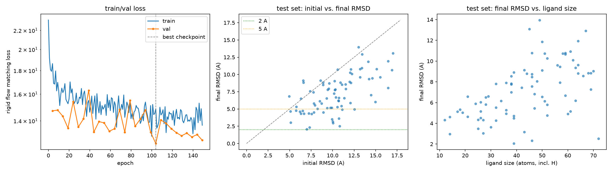

# aidd_generative_docking

Research-grade, Windows-native prototype for **rigid-body protein-ligand
generative docking**: given a fixed protein pocket and a ligand's molecular
graph, an E(3)-aware conditional **Flow Matching** model learns to move a
randomly placed, rigid ligand toward its experimental bound pose.

See [ARCHITECTURE.md](ARCHITECTURE.md) for the full scientific design
(input/output, protein/ligand representation, the rigid-body SE(3) Flow
Matching objective, model variants, dataset/split methodology, the
experiments table, limitations, and future work).

## Status

Pipeline complete end-to-end and validated with a real, held-out
generalization experiment (not just an overfitting sanity check). This is
a small, honestly-scoped v1: rigid ligand, rigid pocket, no affinity
prediction, no virtual screening — see Limitations in
[ARCHITECTURE.md](ARCHITECTURE.md).

## Representative results

Full interactive writeup (diagrams + all charts, built from the same saved
JSON): **[Rigid-Body Docking Flow Matching](https://claude.ai/code/artifact/8cc86170-aeeb-43ec-97a7-6f9ed28e895b)**.
The two plots below are the project's two central findings.

### 1. The dead-zone ablation



Hypothesis: a hard distance cutoff on protein-ligand interaction edges
creates a gradient **dead zone** when a randomized ligand pose starts far
from the pocket (zero edges &rarr; exactly zero gradient from that term).
Tested with a controlled ablation &mdash; identical architecture, seed,
epochs, and hyperparameters, changing only masking&rarr;smooth weighting.
**Confirmed**: hard-cutoff training loss plateaus at ~39; the soft-weighted
model converges to ~11 under the exact same protocol (Table 1 in
[ARCHITECTURE.md](ARCHITECTURE.md)).

### 2. Held-out generalization (not an overfitting sanity check)



The final soft-weighted model, architecturally unchanged, trained on 640
complexes and evaluated **exactly once** on 80 disjoint, never-seen test
complexes (deterministic, protein/ligand-similarity-aware split — see
[ARCHITECTURE.md](ARCHITECTURE.md)):

- Mean RMSD **10.29 &rarr; 7.14 &Aring;**, median **10.24 &rarr; 6.75 &Aring;**
- Success rate **25% @5 &Aring;**, **0% @2 &Aring;** (stated plainly — not a
  competitive docking result)
- Smaller ligands generalize markedly better: 5.08 &Aring; mean RMSD for
  12&ndash;36-atom ligands vs. 8.61 &Aring; for 51&ndash;72-atom ligands

This is a small, honestly-scoped v1 result: real signal that the model
learned something structurally sensible, not a benchmark claim.

## Project stages (all complete for this project's v1 scope)

1. ✅ PDBBind data preparation (real PDBBind v2020.R1 archive; see
   `data/pdb_io.py`, `data/dataset_builder.py`)
2. ✅ Protein / ligand geometric representation (PyTorch Geometric graphs;
   `data/featurize.py`)
3. ✅ Rigid-body SE(3) conditional Flow Matching model, with an ablation
   confirming a hard-cutoff-cross-edge "dead zone" hypothesis and a soft
   distance-weighted fix (`diffusion/rigid_flow_matching.py`, `models/`)
4. ✅ Ligand pose generation via Euler integration of the learned vector
   field (`diffusion/rigid_flow_matching.py::integrate_rigid_pose`)
5. ✅ RMSD / pose-success evaluation, on a genuinely held-out test set
   (`evaluation/metrics.py`, `outputs/held_out/`)
6. ⬜ Future work (not implemented): ligand torsional flexibility,
   protein-pocket flexibility, affinity/ranking heads, larger-scale virtual
   screening — see ARCHITECTURE.md.

## Environment

- **Platform:** Windows-native. No Linux/WSL dependency anywhere in this
  project.
- **Conda env:** `sxt-torch` (PyTorch + CUDA + PyTorch Geometric + RDKit +
  Biopython, all already installed there).
- **Compute:** GPU-first (CUDA; validated on an NVIDIA RTX 5080). CPU
  fallback works but is not the target path.
- **Core stack:** PyTorch, PyTorch Geometric, RDKit, Biopython, SciPy
  (`scipy.spatial.transform.Rotation` for SO(3) sampling/geodesics), NumPy.
- **Data:** the official, licensed PDBBind v2020.R1 archive
  (`data/raw/P-L.tar.gz` + `index.tar.gz`), obtained by the user directly
  from pdbbind-plus.org.cn — **not redistributed** and gitignored under
  `data/raw/`. PDBBind's terms require registration and forbid
  redistribution; see the module docstring in `data/pdbbind.py` for the
  earlier small public-RCSB smoke-test substitute used before this
  archive was available.

## Repository layout

```
configs/                      experiment configs (YAML)
src/aidd_generative_docking/
    data/
        pdb_io.py                  low-level PDB I/O: RCSB download (legacy),
                                    PDBBind archive extraction, index parsing
        featurize.py                ligand (RDKit) + pocket (Biopython) featurization
        sample.py                   assembles one ComplexSample (ligand + pocket graphs)
        pdbbind.py                   legacy 3-complex public-RCSB smoke-test manifest
        splitting.py                 deterministic, protein/ligand-similarity-aware split
        dataset_builder.py           candidate selection + per-complex validation
        constants.py                 shared vocabularies (elements, residues, bond types)
    models/
        rigid_equivariant.py         Milestone 2: dense-pocket-conditioning rigid vector field
        cross_interaction_equivariant.py   Milestone 3: hard-cutoff dynamic cross edges + RBF
        soft_cross_interaction_equivariant.py  Milestone 3 ablation: soft distance-weighted (final model)
        rbf.py                       Gaussian radial basis function distance encoding
        equivariant.py               original generic per-atom stub (superseded, kept as-is)
    diffusion/
        rigid_flow_matching.py       SE(3) rigid-body path/objective/sampling (used by all models)
        flow_matching.py             original per-atom linear-path scaffolding (superseded, kept as-is)
    training/
        smoke_train_rigid.py         Milestones 2/3: 10-complex full-batch overfitting sanity check
        train_held_out.py            final experiment: mini-batch training + val-based checkpointing
        train.py                     original config-driven stub (not yet wired up)
    evaluation/
        metrics.py                   RMSD, pose-success-rate
tests/                         unit tests for every module above (see below)
notebooks/                     runnable scripts: data inspection, smoke experiments,
                                dataset preparation, and the final held-out experiment
report/                        tracked, shareable deliverables
    experiment_report.html         full interactive writeup (published as an Artifact)
    figures/                       representative PNGs embedded in this README
outputs/                       gitignored experiment outputs (JSON summaries, plots, checkpoints)
```

## Running tests

From the repo root, using the `sxt-torch` environment's Python directly:

```
conda run -n sxt-torch pytest
```

Tests that need the licensed PDBBind archive (`data/raw/P-L.tar.gz`) skip
automatically if it isn't present locally.

## Reproducing the experiments

All scripts are runnable directly (no CLI arguments) with the `sxt-torch`
environment, from the repo root, e.g.:

```
conda run -n sxt-torch python notebooks/prepare_held_out_dataset.py
conda run -n sxt-torch python notebooks/run_held_out_experiment.py
```

- `notebooks/inspect_sample.py`, `notebooks/inspect_pdbbind_archive_sample.py`
  — data pipeline inspection (Milestones 1-2).
- `notebooks/smoke_train_rigid_flow_matching.py`,
  `notebooks/smoke_train_cross_interaction_comparison.py`,
  `notebooks/smoke_train_soft_cross_interaction_ablation.py` — the
  10-complex overfitting sanity checks and model-comparison ablations
  (Milestones 2-3).
- `notebooks/prepare_held_out_dataset.py` then
  `notebooks/run_held_out_experiment.py` — the final, genuinely held-out
  generalization experiment; results in `outputs/held_out/`.

## Non-goals

This project does not implement (see ARCHITECTURE.md's Future Work):
ligand torsional flexibility, protein-pocket flexibility, binding affinity
or ranking prediction, or virtual screening. No benchmark performance
claims are made anywhere in this repository.
